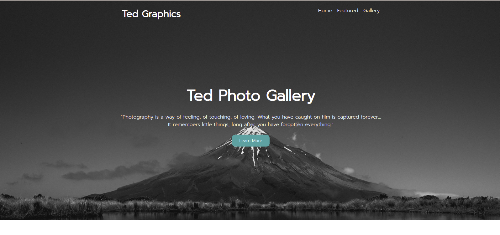
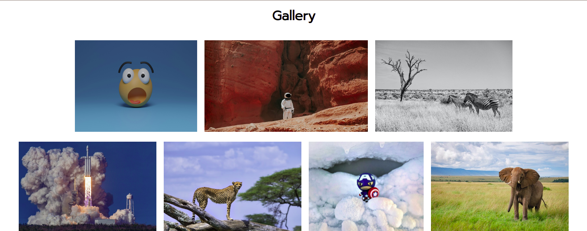

 <div style="text-align: center; ">
        <div>
            <h1>Hi There, I'm <span style="color: green">Teddy Omondi</span> &#128075</h1>
            <h3>Upcoming Junior Software Developer &#128187; &#127911;</h3>
        </div>
        
</div>
<br>

<h1>Photography Website &#128248 </h1>

This is a Photography website. The website showcases some of the cool photos that i have come across on the internet

<br>



<br>

<h2>Demo &#128273;</h2>

Here is a live link to the project 


https://dev-teddy.github.io/photograpy-website/



## Usage

If you want to view the code or change some elements on the website, you are welcomed to clone the project

```git
git clone git@github.com:Dev-Teddy/photograpy-website.git

```

<h2>Technology Used &#128187; </h2>

1. Html

2. CSS


<h2>Author <span>&#128104;&#127997;</span> </h2>

Teddy Omondi

## License
[MIT](https://choosealicense.com/licenses/mit/)
